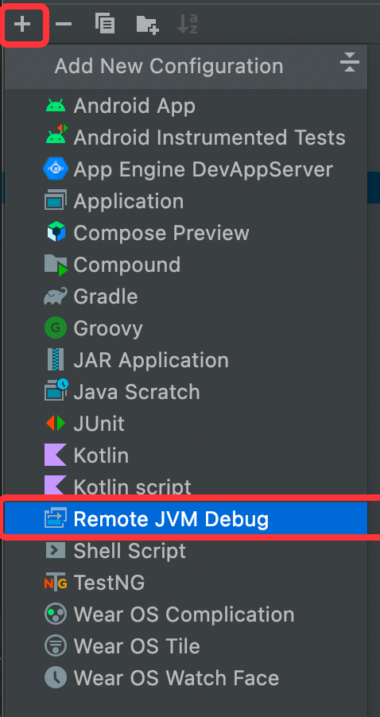

github地址：https://github.com/hardy666666/AsmTrackDemo

# 1.编译并发布插件  
## 1.1 修改插件版本
./AsmTrack/build.gradle:46<br>


## 1.2 编译并发布到repo仓库  
./gradlew :AsmTrack:publishHelloAsmPublicationToMavenRepository<br> 
or<br>


## 1.3 使用插件  
./build.gradle:10<br>


# 2.调试插件
## 2.1.点击Edit Configurations


## 2.2.点击+号，选择Remote


## 2.3.随意输入名称，其他参数不要动


## 2.4.然后在Terminal中输入如下命令
```
./gradlew --no-daemon -Dorg.gradle.debug=true :app:{taskName}
```
taskName是我们调试的task，比如assembleDebug、assembleRelease等  
例如：  
```
./gradlew --no-daemon -Dorg.gradle.debug=true clean :app:assembleDebug
```
输入命令后调试进程处于阻塞状态：


## 2.5.最后在你想要调试的地方加上断点，点击调试按钮，这样就可以愉快的开始调试了。

